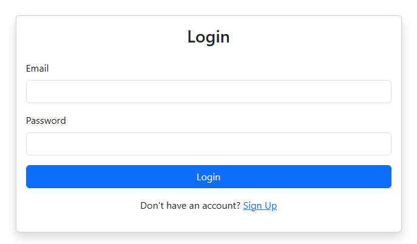
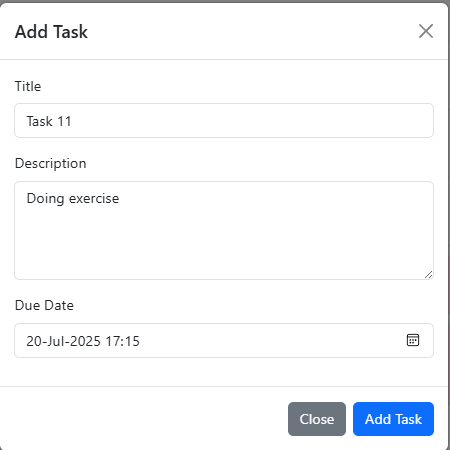

# Task Management System

A web-based application for managing task lists and tasks, built with a React frontend and a Spring Boot backend. Users can create, edit, and delete task lists and tasks, track completion status, set due dates, and filter tasks. Task lists with all tasks completed are highlighted in light green for easy identification.

## Features

- **Task List Management**:
  - Create, edit, and delete task lists.
  - View task lists in an accordion layout with Bootstrap styling.
  - Task lists with all tasks completed are highlighted in light green.
- **Task Management**:
  - Add, edit, and delete tasks within a task list.
  - Set task title, description, due date, and completion status.
  - Mark tasks as completed with a checkbox.
  - Highlight overdue tasks (past due date and not completed) in light red.
  - Email notification every time a task is due
- **Task Filtering**:
  - Filter tasks by: All, Completed, Uncompleted, Overdue, Not Overdue.
- **Responsive UI**:
  - Bootstrap-based interface with modals for adding/editing tasks and task lists.
  - Smooth animations and hover effects for better user experience.
- **Error Handling**:
  - Validation for empty titles and invalid task list IDs.
  - User-friendly error messages with dismissible alerts.

## Tech Stack

- **Frontend**:
  - React (v18.x)
  - Bootstrap (v5.x) for styling
  - Axios for API requests
  - date-fns for date formatting
- **Backend** (assumed):
  - Spring Boot with JPA for RESTful API
  - MySQL/PostgreSQL (configurable database)
- **Tools**:
  - Node.js (v16+)
  - Maven for backend build
  - Git for version control

## Setup Instructions

### Prerequisites
- **Node.js** (v22)
- **Java** (v21)
- **Maven** (v3.6+)
- **MySQL**
- **Git**

### Installation

1. **Clone the Repository**:
   ```bash
   git clone https://github.com/<your-username>/<your-repo>.git
   cd <your-repo>
   ```

2. **Backend Setup**:
   - Configure the database in `application.yml`:
     ```yaml
      spring:
        datasource:
          url: jdbc:mysql://localhost:3306/taskdb
          username: root
          password: yourpassword
        jpa:
          hibernate:
            ddl-auto: update
      mail:
        username: <your-email>@gmail.com
        password: <your-email-password
     ```
   - Build and run the backend:
     ```bash
     mvn clean install
     mvn spring-boot:run
     ```
   - The backend will run on `http://localhost:8080`.

3. **Frontend Setup**:
   - Navigate to the frontend directory (e.g., `frontend/`):
     ```bash
     cd frontend
     ```
   - Install dependencies:
     ```bash
     npm install
     ```
   - Start the frontend:
     ```bash
     npm start
     ```
   - The frontend will run on `http://localhost:3000`.

### API Endpoints
- **Task Lists**:
  - `GET /api/task-lists/{userId}`: Fetch all task lists for a user.
  - `POST /api/task-lists`: Create a new task list.
  - `PUT /api/task-lists/{id}`: Update a task list.
  - `DELETE /api/task-lists/{id}`: Delete a task list.
- **Tasks**:
  - `GET /api/tasks/task-list/{taskListId}`: Fetch tasks for a task list.
  - `POST /api/tasks`: Create a new task.
  - `PUT /api/tasks/{id}`: Update a task.
  - `DELETE /api/tasks/{id}`: Delete a task.

## Usage

1. **Access the Application**:
   - Open `http://localhost:3000/tasks` in your browser.
   - Log in to authenticate (JWT token stored in `sessionStorage`).

2. **Manage Task Lists**:
   - Enter a title and click "Add Task List" to create a new task list.
   - Use the "Edit" button to modify a task list title.
   - Use the "Delete" button to remove a task list.
   - Task lists with all tasks completed are highlighted in light green.

3. **Manage Tasks**:
   - In a task list accordion, click "Add New Task" to create a task.
   - Set task title, description, and due date in the modal.
   - Mark tasks as completed using the checkbox.
   - Filter tasks using the dropdown (All, Completed, Uncompleted, Overdue, Not Overdue).
   - Overdue tasks (past due date and not completed) are highlighted in light red.

4. **UI Indicators**:
   - **Light Green Background**: Task list has all tasks completed.
   - **Light Red Background**: Task is overdue (past due date and not completed).
   - **Strikethrough Text**: Task is marked as completed.

## Screenshots

*Add screenshots of the application here (e.g., task list accordion, task modal, filters).*

- Login: 
  
- Task List View: 
  
- Task Modal: 
  

*Note: Update the repository with actual screenshot files and adjust paths accordingly.*

## Contributing

Contributions are welcome! To contribute:

1. Fork the repository.
2. Create a new branch (`git checkout -b feature/your-feature`).
3. Make your changes and commit (`git commit -m "Add your feature"`).
4. Push to the branch (`git push origin feature/your-feature`).
5. Open a Pull Request.

Please ensure your code follows the project's coding standards and includes tests where applicable.